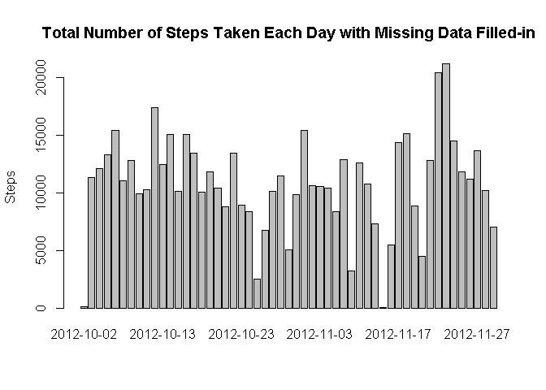

## Loading and preprocessing the data

### 1. Load Data


```r
library(dplyr)
library(knitr)
library(lattice)

opts_chunk$set(cache = TRUE, echo = TRUE)
```


```r
activity <- read.csv("activity.csv")
activity$date <- as.Date(activity$date)
```

## What is mean total number of steps taken per day?

### 2. Histogram of the total number of steps taken each day


```r
totalStepPerDay <- aggregate(steps ~ date, data = activity, sum, na.rm = TRUE)
with(totalStepPerDay, barplot(height = steps, names.arg = date, xlab = "", ylab = "Steps", main = 'Total Number of Steps Taken Each Day'))
```

<!-- -->

## What is the average daily activity pattern?

### 3. Mean and median number of steps taken each day


```r
meanStepPerDay <- mean(totalStepPerDay$steps, na.rm = TRUE)
medianStepPerDay <-  median(totalStepPerDay$steps, na.rm = TRUE)
```

The mean number of steps taken each day is 10766.19.  
The median number of steps taken each day is 10765.

### 4. Time series plot of the average number of steps taken


```r
meanStepPerInterval <- activity %>% group_by(interval) %>% summarize(mean = mean(steps, na.rm = TRUE))

with(meanStepPerInterval, {
  plot(interval, mean, type = 'l',
       main = 'Average Steps by Time Interval',
       xlab = '5 Minute Time Interval',
       ylab = 'Average Number of Steps')
})
```

<!-- -->

### 5. The 5-minute interval that, on average, contains the maximum number of steps


```r
maxStep <- activity[which.max(activity$steps),]
```

The maximum number of steps per 5-minute interval is 806 at 2012-11-27 interval 615.

## Imputing missing values

### 6. Code to describe and show a strategy for imputing missing data

1. Calculate and report the total number of missing values in the dataset (i.e. the total number of rows with NAs)


```r
meanStepCount <- sum(is.na(activity$steps))
meanStepPercent <- mean(is.na(activity$steps)) * 100
```

The total number of missing values (i.e. N/A) in the dataset is 2304 (13.1147541%).

2. Devise a strategy for filling in all of the missing values in the dataset. The strategy does not need to be sophisticated. For example, you could use the mean/median for that day, or the mean for that 5-minute interval, etc.

In order to fill-in the missing values, we will use the mean of the steps for the same 5 minute interval across all the days.

3. Create a new dataset that is equal to the original dataset but with the missing data filled in.


```r
meanStepPerInterval <- activity %>% group_by(interval) %>% summarize(mean = mean(steps, na.rm = TRUE))

newActivity <- activity %>% inner_join(meanStepPerInterval, by = "interval") %>% mutate(steps = ifelse(is.na(steps), mean, steps)) %>% select(steps, date, interval) 
```

```
## Warning: package 'bindrcpp' was built under R version 3.4.3
```

```r
head(newActivity)
```

```
##       steps       date interval
## 1 1.7169811 2012-10-01        0
## 2 0.3396226 2012-10-01        5
## 3 0.1320755 2012-10-01       10
## 4 0.1509434 2012-10-01       15
## 5 0.0754717 2012-10-01       20
## 6 2.0943396 2012-10-01       25
```

4. Make a histogram of the total number of steps taken each day and Calculate and report the mean and median total number of steps taken per day. Do these values differ from the estimates from the first part of the assignment? What is the impact of imputing missing data on the estimates of the total daily number of steps?


```r
totalNewStepPerDay <- aggregate(steps ~ date, data = newActivity, sum, na.rm = TRUE)

meanNewStepPerDay <- mean(totalNewStepPerDay$steps, na.rm = TRUE)
medianNewStepPerDay <- median(totalNewStepPerDay$steps, na.rm = TRUE)
```

The mean number of steps taken each day without and with missing data filled-in are 10766.19 and 10766.19 respectively. The impact of having missing data filled-in is insignificant.  
The median number of steps taken each day without and with  missing data filled-in are 10765 and 10766.19 respectively. The impact of having missing data filled-in is insignificant. 

### 7. Histogram of the total number of steps taken each day after missing values are imputed


```r
with(totalNewStepPerDay, barplot(height = steps, names.arg = date, xlab = "", ylab="Steps", main = 'Total Number of Steps Taken Each Day'))
```

<!-- -->

## Are there differences in activity patterns between weekdays and weekends?

### 8. Panel plot comparing the average number of steps taken per 5-minute interval across weekdays and weekends


```r
newActivityWeekday <- newActivity %>% mutate(weekday = ifelse(weekdays(date) %in% c("Saturday", "Sunday"), "weekend", "weekday"))

newActivityWeekday$weekday <- as.factor(newActivityWeekday$weekday)

meanStepPerWeekDay <- aggregate(steps ~ interval + weekday, data = newActivityWeekday, mean)
names(meanStepPerWeekDay) <- c("interval", "weekday", "steps")

xyplot(steps ~ interval | weekday, meanStepPerWeekDay, type = "l", layout = c(1, 2), 
       xlab = "Interval", ylab = "Average Number of Steps")
```

<!-- -->

